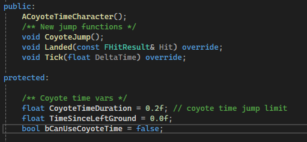
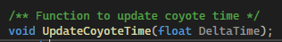
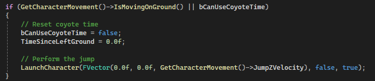
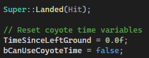
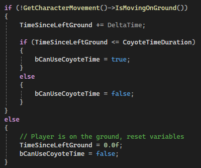

# CoyoteTime
 A demo to create a Coyote Time jump 
Try to implement the mechanic using the following hints to adjust the CoyoteTime Character scripts:
You will need to rebind input in C++, implement 3 functions and add a tick function
## Header Hints

## CPP Hints

